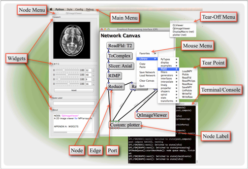

############
Introduction
############

GPI is a development environment for scientific algorithms that provides a
visual workspace for assembling algorithms. Algorithm elements (i.e. nodes) can
be linked together to form a flow diagram. Each node is executed according to
the hierarchy of the diagram.

This document provides information about configuring and navigating the user
interface as well as extending GPI through the development of new nodes.

The sections :ref:`config-rst` and :ref:`ui-rst` will aid in getting GPI setup
and will provide an overview of the UI visuals, keyboard and mouse controls.

The :ref:`devguide-rst` is meant to serve as an overview of the node
development process as well as introduce the code elements that will be
required in a complete node code.

The :ref:`node_api-rst` and :ref:`widgets-rst` sections are reference pages
that provide the complete parameter sets, methods, and functions required to
generate a complete node.

The :ref:`pyfi_api-rst` section covers the use of the PyFI libraries in
extending Python with C/C++ code.
