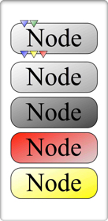

##############
User Interface
##############
This section covers information about how specific aspects of the UI, including
mouse interactions and keyboard shortcuts.

Canvas
======
The main GPI workspace is the *canvas*. Most of the essential tools the user
will need to construct networks and prototype algorithms are found here.

.. figure:: uilabels.jpg
    :align: center

    *Figure 1* - A screen capture of an active GPI session with superimposed
    labels identifying each UI component.

GPI network manipulation tools are mostly accessible within the Mouse Menu
which can be opened by right-clicking on the Network Canvas (Fig. 1). From this
menu, nodes can be instantiated, copy/paste, saved/loaded as a network, and the
canvas can be completely cleared. Node (Python source code), network (\*.net)
files, and data files can also be dragged and dropped on the canvas from a file
browser. This will instantiate the Nodes associated with the code, network,
or data or data that has been dropped.

If GPI is launched from a terminal, all Node and Network Canvas information
will be echoed to the terminal window. This can aid in debugging runtime
errors. hat has been dropped.

Additionally, the Nodes and Ports have a color code to indicate their status
(Fig. 2). The background color code is as follows: idle (light grey), running
(dark grey), error (red), warning (yellow). Error states do not allow the Node
to be run again (the Node can be copied and pasted to retry). The warning state
(like the idle state) will allow the Node to reenter the event-loop. The input
Ports can be blue or green for required or optional input respectively. The
output Ports are blue (indicating success), yellow (unchanged), and red (no
data and no downstream event).

    *Figure 2* - Node color corresponds to state. Port colors correspond to
    state and data obligation.

As Nodes are instantiated on the canvas they briefly turn dark grey indicating
that they are running their kernel (``compute()`` function) code. As Nodes are
connected and Widgets are modified they automatically trigger ``compute()``
events which flow down connections of the network. This execution flow can be
paused by selecting ‘Pause’ from the Mouse Menu. Networks and Widgets can be
modified in pause mode and will start execution when un-paused.

The Network Canvas has a tabbed interface allowing more canvases to be
instantiated and run simultaneously. Nodes can then be copied and pasted
between canvases allowing the user to easily consolidate emergent or
spontaneous design changes. Layouts, spawned from the Mouse Menu, can also be
used to tie Widgets from various Nodes together, making a single unified
‘control panel’ for networks on a single canvas. Finally, macro-Nodes can also
be used to aggregate multiple Nodes into a single representation on the canvas.
A macro-Node is instantiated from the Mouse Menu. Connections between the
‘Input’ and ‘Output’ Nodes are enveloped within the macro when either Node is
double-clicked.Mouse & Keyboard Command List: This section lists how to
interact with the display items shown in Fig. 1.

Keyboard & Mouse Controls
=========================

Network Canvas
--------------
.. csv-table::
   :header: "Key/Button", "Function"

   "Left Click", "select Nodes or drag to select multiple Nodes"
   "Middle Click + Drag", "move the Network Canvas relative to view"
   "Scroll Wheel", "zoom in and out of the Network Canvas"
   "Right Click", "Mouse Menu"
   "Tab", "cycle Node selection"
   "Ctrl/⌘+C", "copy selected Nodes"
   "Ctrl/⌘+L", "load a network"
   "Ctrl/⌘+O", "organize selected Nodes"
   "Spacebar or Ctrl/⌘+P", "pause/unpause"
   "Ctrl/⌘+R", "reload selected nodes"
   "Ctrl/⌘+S", "save a network"
   "Ctrl/⌘+T", "open a new canvas tab"
   "Ctrl/⌘+V", "paste selected Nodes"
   "Ctrl/⌘+X", "close all node menus of the current canvas tab"
   "Delete/Backspace", "delete selected Nodes"
   "Up, Down, Left, Right Arrows", "move selected Nodes across the Network Canvas"

Node Menu
---------
.. csv-table::
   :header: "Key/Button", "Function"

   "Left Click", "select Widget"
   "Left Double Click", "show/hide Widget"
   "Middle Click + Drag (Option + Left Click + Drag in OSX)", "grab Widget and
   place in a layout or macro-node menu"
   "Right Click", "open Widget-Port menu"
   "Tab", "cycle focus through Widgets"

Node
----
.. csv-table::
   :header: "Key/Button", "Function"

   "Left Click", "select Node"
   "Left Click+Drag", "move Node"
   "Right Click", "Node Menu"
   "Ctrl/⌘+Right Click", "open the Node’s python code."
   "Hover", "display compute() wall time and total outport memory used"

Macro-Node
----------
.. csv-table::
   :header: "Key/Button", "Function"

   "Left Double Click", "open/close the macro"

Edge
----
.. csv-table::
   :header: "Key/Button", "Function"

   "Right Click", "Edge delete menu"

Port
----
.. csv-table::
   :header: "Key/Button", "Function"

   "Middle Click", "raise all connectable Ports"
   "Middle Click+Drag", "draw connection Edge to another Port"
   "Right Click (InPorts)", "delete the upstream connection"
   "Hover", "display Port type and held data information"

